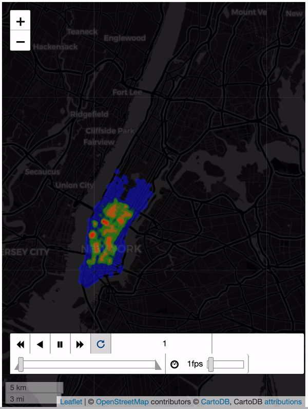

# NYU CUSP | Data Visualization Final Challenge
#### Analyzing ride-hailing services in Manhattan area.

We would like to understand the impact of ride-pooling, particularly if all rides are meant to be shared. We will verify and study some scenarios/tasks we chose in this challenge.

# Scenarios

#### [2] For those trips that could not be served, do they follow a spatial or temporal pattern? For example, are most of those trips originated in particular regions, and of certain times?

</img>

    Looking at the requests not served over the course of the day we see:

      1. A large number of requests not served in Greenwich Village in the early hours of the day. From 2-6am
      2. At 7am, this randomly disperses to most of Lower Manhattan.
      3. After 7am, the requests not served disperses north through the rest of Manhattan. With lots of unserved requests in Midtown and Upper East Side. 8-11am
      4. From noon until 8pm, the number of rides unserved in Midtown steadily rises.
      5. From 8pm to midnight, the number of rides unserved decreases across the board.

#### [4] We also limit vehicle capacity to at most 4 passengers. Were there vehicles violating this condition? If so, can you show any pattern about these vehicles? For example, how many of them were violating, and where were they distributed in both time and space?

#### [5] What can we learn about the vehicle utilization? Are most of them empty, or with 1, 2, 3 or 4 passengers? Are there particular vehicles that tend to ride with more passengers than others? If so, how are they distributed in space and time.

#### [8] If we are to pick a particular vehicle ID, how can we effectively illustrate its activities throughout the day?

  The best way to effectively illustrate a particular vehicle's activities throughout the day would be to visualize it's paths for each hour, the locations of all of it's pickups and drop-offs and the average number of passengers the vehicle carried compared to the rest of the vehicles for that day.

              Driver 4                               Driver 255
  </img>
  </img>
  
 These GIFs show the path each driver takes at each hour over the course of the day. This will help visualize the activity of the driver at any point. Additionally, we will be able to see when they are not driving and idle, and when they were most active in terms of distance traveled. Comparing side by side, allows us to compare the trends of two separate drivers. 

   

  </img>
  </img>
  </img>
  </img>
  
 These plots show the pickup and dropoff locations of each driver over the entire day. This allows us to see any spatial trends the driver takes in terms of where they pickup/dropoff passengers. As we can see, Driver 4 on the left, tends to pickup passengers in Chelsea and West Midtown, whereas Driver 255 is more likely to pick up a passenger in the Upper East Side. 

 

  
  
    
 These plots are supplementary to the maps above and give a better temporal view of our driver's behaviors. They are meant to show the average number of passengers the driver has per hour of the day. As is obvious here, Driver 4 is idle or at home between 3am and 8am where they pick up no passengers. Additionally, the driver is inactive after 7pm until 1am.
    We can also see how these drivers compare to the passenger rates of all of the drivers across Manhattan. 

