# Data Visualization Final Challenge
## Ride-Pooling Simulation
Authors:  
* Rohun Iyer [ri619]
* Tanya Nabila [tn1050]

#### Analyzing ride-hailing services in Manhattan area.
We would like to understand the impact of ride-pooling, particularly if all rides are meant to be shared. We will verify and study some scenarios/tasks we chose in this challenge.

# Scenarios

## [2] For those trips that could not be served, do they follow a spatial or temporal pattern? For example, are most of those trips originated in particular regions, and of certain times?

    Looking at the requests not served over the course of the day we see:

      1. A large number of requests not served in Greenwich Village in the early hours of the day. From 2-6am
      2. At 7am, this randomly disperses to most of Lower Manhattan.
      3. After 7am, the requests not served disperses north through the rest of Manhattan. With lots of unserved requests in Midtown and Upper East Side. 8-11am
      4. From noon until 8pm, the number of rides unserved in Midtown steadily rises.
      5. From 8pm to midnight, the number of rides unserved decreases across the board.

## [4] We also limit vehicle capacity to at most 4 passengers. Were there vehicles violating this condition? If so, can you show any pattern about these vehicles? For example, how many of them were violating, and where were they distributed in both time and space?
Vehicles violating this condition indeed exist in the dataset! After reading in the vehicle paths dataset, `vehicle_paths_pnas`, we see that _all_ the vehicles have violated this condition, but this might be due to an error in the system since the number of passengers range from -2 to 100 and an average of 33 passengers at a moment was found. As we can observe from the boxplot below, every driver's average number of passengers is above the limit of 4 passengers. 
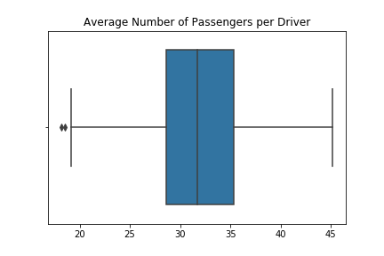

In the heatmap below, every "pickup" event that violates the limit (above 4) are represented as a dot and partitioned for every hour.  
 

The distributions of these violations can be seen spatially and throughout time as they are more dispersed across Manhattan, but becomes *concentrated* in the midtown area around hour 6-9 AM.
 
## [5] What can we learn about the vehicle utilization? Are most of them empty, or with 1, 2, 3 or 4 passengers? Are there particular vehicles that tend to ride with more passengers than others? If so, how are they distributed in space and time.
After reading in the vehicle paths dataset, `vehicle_paths`, we see that the distributions of the number of passengers on each Pickup/Dropoff event is as follows.  
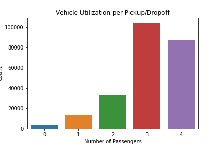
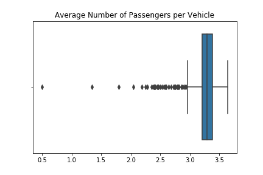  
As seen in the distributions above, majority of the vehicles tend to have a fairly high ridership at an average of 3.24 number of passengers. However, we can see from the boxplot that there are many considered outliers who has low ridership.  
We decided to separate these into two groups, the normal vehicles group and the outlier group with low average number of passengers (based on the IQR outlier calculations). We then compare the differences in these distributions in the Heatmap per hour plots below.  
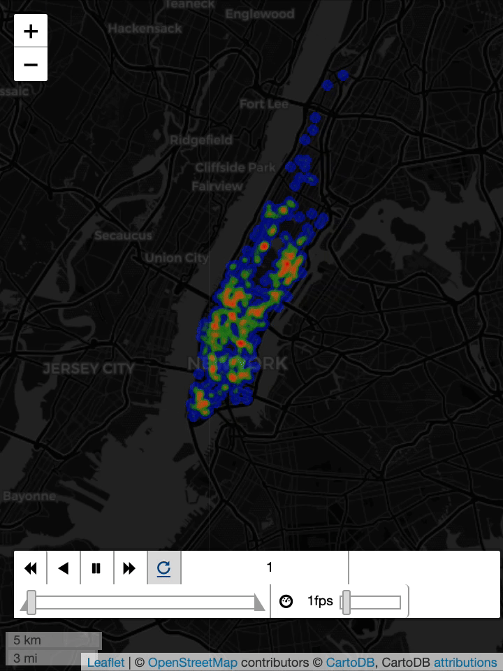
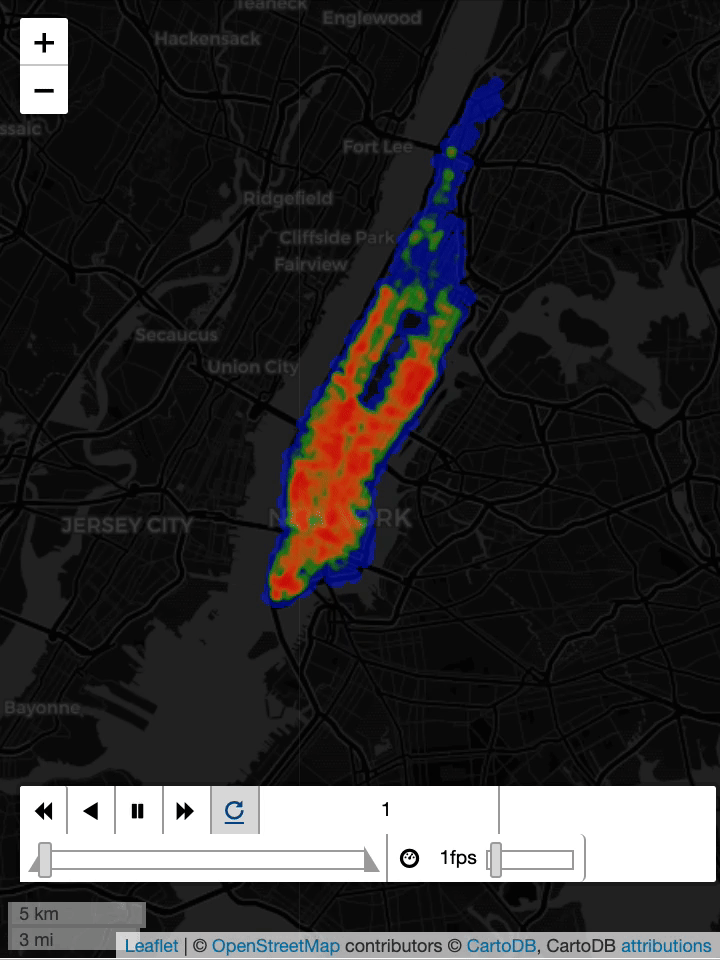  
The group of vehicles with exceptionally low average vehicle utilization is on the left while the normal vehicles group is on the right. We can easily see from the map that vehicles with low vehicle utilization tend to only work at night as we observe them appear from 8PM and gradually grow in numbers from midnight to its peak at 2 AM and slowly decreases until about 6 AM. 

## [8] If we are to pick a particular vehicle ID, how can we effectively illustrate its activities throughout the day?

  The best way to effectively illustrate a particular vehicle's activities throughout the day would be to visualize it's paths for each hour, the locations of all of it's pickups and drop-offs and the average number of passengers the vehicle carried compared to the rest of the vehicles for that day.
Driver 4 Driver 255 

  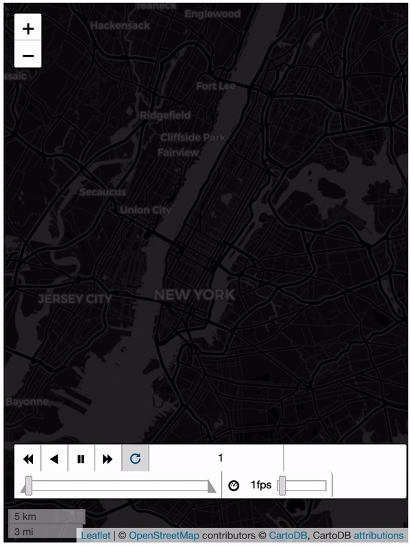
  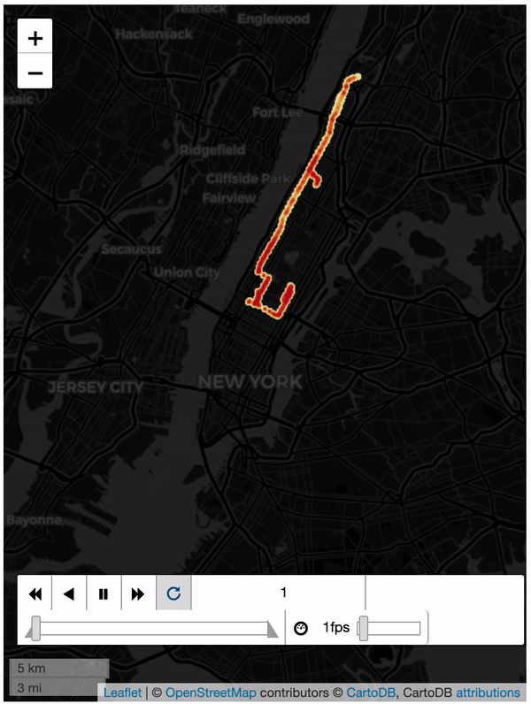
  
 These GIFs show the path each driver takes at each hour over the course of the day. This will help visualize the activity of the driver at any point. Additionally, we will be able to see when they are not driving and idle, and when they were most active in terms of distance traveled. Comparing side by side, allows us to compare the trends of two separate drivers. 

   

  
  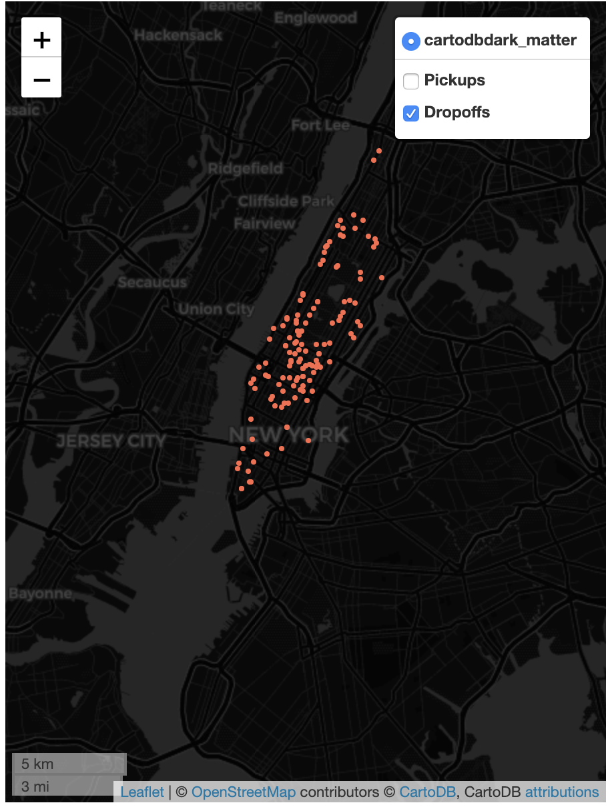
  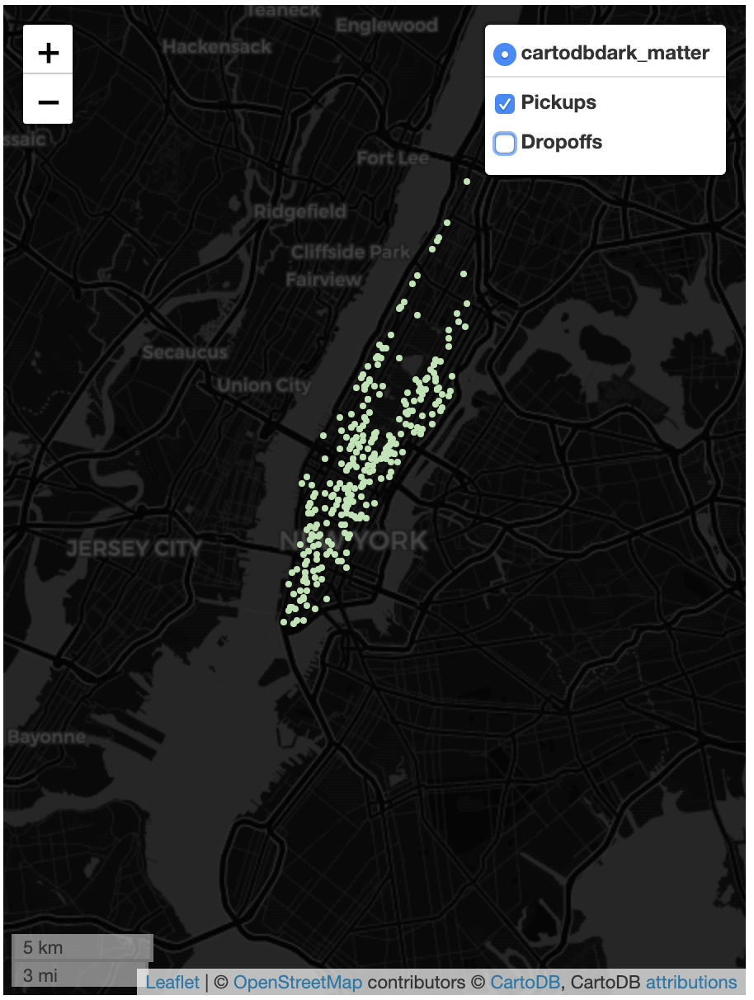
  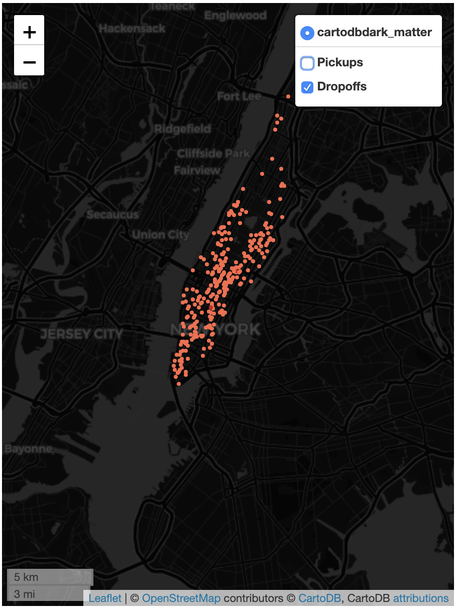
  
 These plots show the pickup and dropoff locations of each driver over the entire day. This allows us to see any spatial trends the driver takes in terms of where they pickup/dropoff passengers. As we can see, Driver 4 on the left, tends to pickup passengers in Chelsea and West Midtown, whereas Driver 255 is more likely to pick up a passenger in the Upper East Side. 

 

  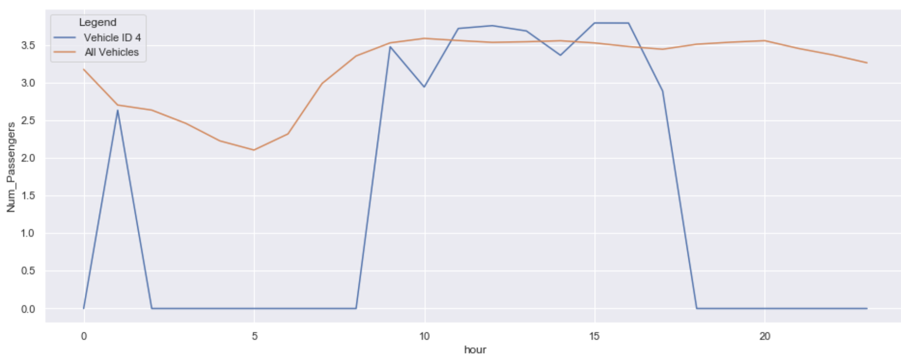
  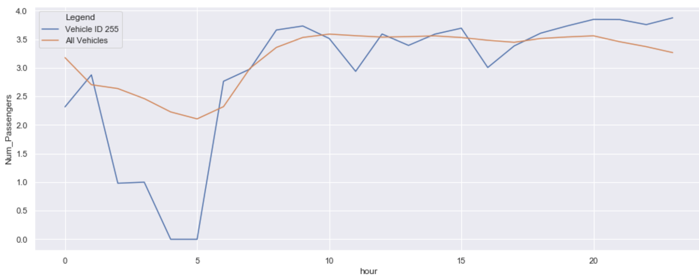
    
 These plots are supplementary to the maps above and give a better temporal view of our driver's behaviors. They are meant to show the average number of passengers the driver has per hour of the day. As is obvious here, Driver 4 is idle or at home between 3am and 8am where they pick up no passengers. Additionally, the driver is inactive after 7pm until 1am. We can also see how these drivers compare to the passenger rates of all of the drivers across Manhattan. 

